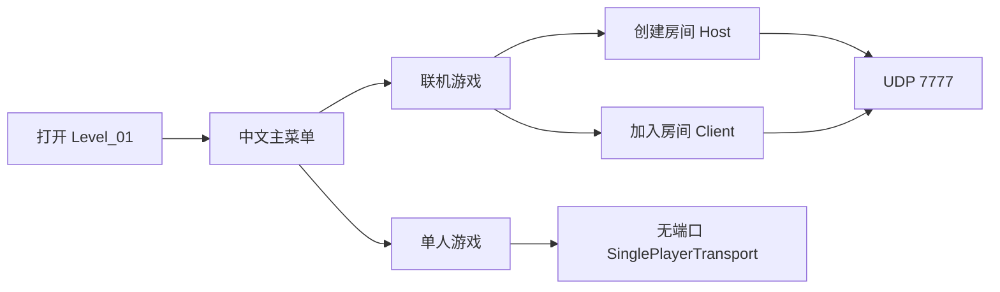

# 01 - 项目与运行

## 项目是什么

Odyssey 是一个 Unity 2023.2 的客户端作品集切片。它用第三人称角色控制、近远程敌人、可解释 AI、CSV 配置、版本化存档、自动化测试和两人 Host 权威联机展示工程能力。它的目标是展示边界清晰、能跑能测的实现，而不是模拟完整商业游戏的在线服务。

## 运行前检查

- 使用 Unity `2023.2.20f1c1` 打开工程；包版本以 [Packages/manifest.json](../../Packages/manifest.json) 为准。
- 主要场景是 [Level_01.unity](../../Assets/_Project/Content/Scenes/Level_01.unity)，输入资产是 [GameInput.inputactions](../../Assets/_Project/Content/Input/GameInput.inputactions)。
- 原型引用 3D Game Kit Lite 与 TMP 示例资产。缺少合法来源的原始资源时，场景可能无法完整打开；不要把第三方资源重新提交进仓库。

## 从菜单进入玩法

单人模式同样启动一个封闭的一人 Host，但使用 `SinglePlayerTransport`，不会占用 UDP 端口。因此单机和联机共享关卡对象与网络生命周期，避免维护两套玩法逻辑。联机默认端口为 `7777`，同机双开或局域网直连时由 Host 输入/监听地址。

## 演示时应验证什么

1. 单人模式：移动、跳跃、攻击、冲刺、两组遭遇战、踏板开门、暂停和存读档。
2. 联机模式：先启动 Host，再让 Client 加入；两名角色均可移动，Host 决定伤害、怪物、投射物、复活和门状态。
3. 调试模式：F3 显示 RTT、连接人数和权威生命信息；ESC 打开菜单。联机菜单只关闭本机输入，不能暂停另一位玩家。

## 目录地图

| 目录 | 放什么 | 不该放什么 |
|---|---|---|
| `Assets/_Project/Code` | 自研 C#、程序集定义与 Editor 工具 | 第三方源码、无边界的 `Scripts` 根目录 |
| `Assets/_Project/Content` | 场景、Prefab、动画、输入资产 | 领域规则 |
| `Assets/_Project/Data` | CSV、Resources 配置资产、输入 Reader 资产 | 运行时可变状态 |
| `Tests` 与 `Assets/_Project/Tests` | 纯 C#、EditMode、PlayMode 规格 | 仅靠人工验证的规则 |

下一步阅读 [02 - 架构与装配](02-架构与装配.md)，先建立“谁创建谁、谁依赖谁”的地图。
