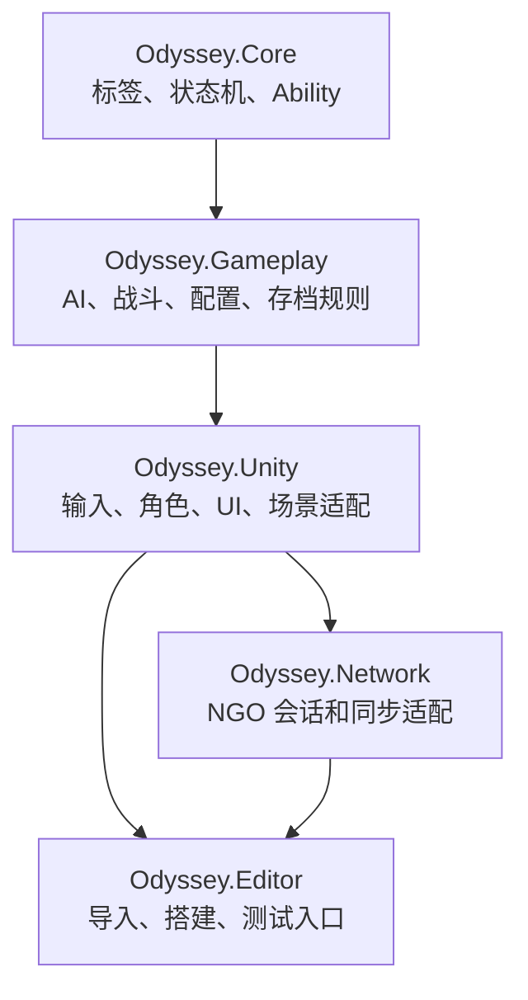
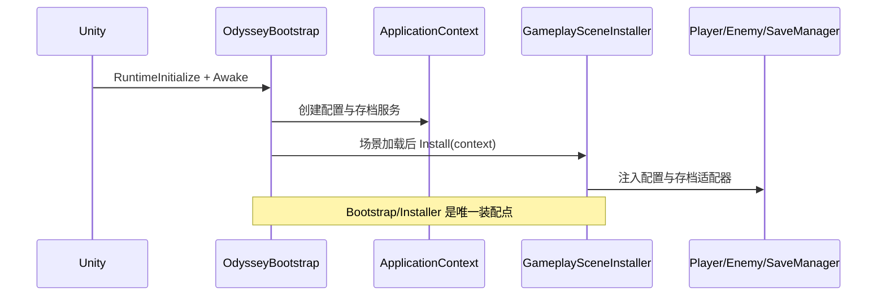

# 02 - 架构与装配

## 先记住四条边界

`Core` 和 `Gameplay` 都不引用 `UnityEngine`，所以其规则可由 [Tests/Core](../../Tests/Core) 快速编译验证。`Unity` 承担 MonoBehaviour、Animator、NavMesh、Input System 和 UI 的适配。`Network` 位于表现/适配层：它不能把 NGO API 泄漏给 Core 规则。程序集依赖以各目录中的 `.asmdef` 为准。

## 生命周期与组合根

[OdysseyBootstrap](../../Assets/_Project/Code/Unity/Bootstrap/OdysseyBootstrap.cs) 创建应用级 `ApplicationContext`，订阅场景加载，并确保场景内有 `GameplaySceneInstaller`。Installer 只扫描它所属场景的根对象，再绑定玩家、敌人和存档组件，防止 Additive 场景相互串线。网络运行时生成的玩家则通过 `InstallRuntimePlayer` 补装配。

## 该如何解释设计取舍

- 不使用全局可变单例：对象依赖在 Composition Root 显式创建和传递，测试可以替换服务，场景切换不会留下隐藏状态。
- 不预建空 Session：当前单机和双人模式的真实会话生命周期不同；有真实状态再创建对象，避免“永远存在但没有意义”的 Manager。
- UI 不轮询玩法状态：领域对象发布事件，Presenter 把事件翻译为显示，避免 UI 直接写入战斗数据。

## 源码阅读入口

1. [ApplicationContext.cs](../../Assets/_Project/Code/Unity/Bootstrap/ApplicationContext.cs)：应用级服务容器。
2. [OdysseyBootstrap.cs](../../Assets/_Project/Code/Unity/Bootstrap/OdysseyBootstrap.cs)：运行时创建和场景监听。
3. [GameplaySceneInstaller.cs](../../Assets/_Project/Code/Unity/Bootstrap/GameplaySceneInstaller.cs)：场景装配边界。
4. [TargetArchitecture.md](../Architecture/TargetArchitecture.md)：命名、事件和状态机约束的完整说明。

面试中可从“依赖为什么不能由角色自己查找”切入：它会把生命周期和具体实现藏起来，使替换、复用与测试都变困难。
