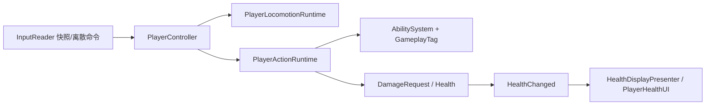

# 03 - 玩家与战斗

## 一次输入如何变成可见结果

[InputReader](../../Assets/_Project/Code/Unity/Input/InputReader.cs) 只保存连续移动/视角快照和一次性动作请求，不直接移动角色。[PlayerController](../../Assets/_Project/Code/Unity/Characters/Player/PlayerController.cs) 是角色组合根：它协调输入、角色控制器、动画、生命、能力和网络端口，但不实现状态规则本身。

## 两条正交状态轴

移动轴（`Grounded`、`Airborne`、`WallSlide`）由 `PlayerLocomotionRuntime` 管理，动作轴（`Free`、攻击、冲刺、受击）由 `PlayerActionRuntime` 管理。它们拆开后，角色可以在空中攻击或冲刺，不必把“空中攻击”“墙滑受击”等组合全部编码成巨型枚举。

状态转换规则放在 [PlayerStatePolicies.cs](../../Assets/_Project/Code/Gameplay/Characters/PlayerStatePolicies.cs)，运行时状态机在 [StateMachine.cs](../../Assets/_Project/Code/Core/FSM/StateMachine.cs)。状态机采用延迟提交：本帧状态先返回转移意图，`Tick` 结束后再统一 `Exit → Enter`，避免遍历中改状态导致半帧可见的不一致。

## 技能与伤害

[AbilitySystem](../../Assets/_Project/Code/Core/Abilities/AbilitySystem.cs) 按“存在性 → 激活态 → 标签 → 冷却 → 提交副作用”验证技能。冲刺授予 `State.Invulnerable` 标签；伤害入口会检查该标签，因此无敌判定不是 UI 或动画的特例。

战斗统一使用 `DamageRequest → DamageResult → HealthChanged`。`Health` 是生命规则所有者，角色和敌人只是 Unity 适配器。新增伤害来源时，应构造请求并走统一入口，不应直接改血量字段，否则会绕过无敌、事件与网络权威。

## 继续读代码

- [PlayerActionRuntime.cs](../../Assets/_Project/Code/Unity/Characters/Player/PlayerActionRuntime.cs)：连击窗口、攻击命中和冲刺。
- [PlayerLocomotionRuntime.cs](../../Assets/_Project/Code/Unity/Characters/Player/PlayerLocomotionRuntime.cs)：地面/空中移动和墙边约束。
- [Health.cs](../../Assets/_Project/Code/Gameplay/Combat/Health.cs)：生命边界与事件。
- [CombatEncounterController.cs](../../Assets/_Project/Code/Unity/Encounters/CombatEncounterController.cs)：将敌人击杀事件汇总为遭遇进度。

常见面试追问是“为什么 Animator 不负责权威位移？”答案是：游戏规则可测试、可同步的状态只能有一个写入者；Animator 只消费参数并表现动画，避免 Root Motion 回写碰撞与玩法状态。
