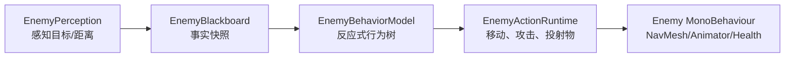

# 04 - AI 与遭遇战

## AI 的三层拆分

感知层只回答“看到了谁、距离多远”；黑板保存可观察事实；行为树只选择下一步意图；动作端口才调用 NavMesh、动画和攻击。这样可以用纯 C# 测试行为选择，又能替换 Unity 表现实现。

[BehaviorTree.cs](../../Assets/_Project/Code/Gameplay/AI/BehaviorTree.cs) 提供反应式 Selector、Sequence、Condition 和 Action 节点。反应式选择器每帧从高优先级重新评估，怪物发现玩家或死亡时不必等待旧巡逻分支完成。[EnemyBehaviorModel.cs](../../Assets/_Project/Code/Gameplay/AI/EnemyBehaviorModel.cs) 用这些通用节点构造敌人策略；[Enemy.cs](../../Assets/_Project/Code/Unity/Characters/Enemies/Enemy.cs) 把策略连接到场景对象。

## 两种敌人和空间压力

- Chomper 以接触/近战为核心，持续压迫玩家位置。
- Spitter 保持安全距离，经过攻击前摇再发射代码驱动投射物。

二者共享感知、黑板、生命和行为树框架，只在配置和动作实现上不同。扩展敌人时优先新增配置与动作策略，不要复制整套 `Enemy` 生命周期。

## 遭遇战与门禁

`CombatEncounterController` 订阅一组敌人的击杀事件，领域对象 `CombatEncounterProgress` 将状态从进行中提交到完成。`EncounterClearancePressurePlate` 同时检查“遭遇完成”和“玩家踩在踏板上”后才请求 `EncounterClearanceGate` 开门。这个拆分避免门直接统计敌人，也使联机层能单独同步开门结果。

## 排错顺序

1. Inspector 是否显示感知目标、当前行为路径和配置 ID。
2. 黑板事实是否正确，再检查行为树优先级，最后才看 NavMesh/动画表现。
3. 门不打开时，分别验证敌人是否被登记、遭遇是否完成、踏板是否有本地或网络玩家进入。

对应自动化规格见 [EnemyBehaviorTreeSpecs.cs](../../Tests/Core/EnemyBehaviorTreeSpecs.cs) 和 [GameplaySliceAcceptance.md](../Acceptance/GameplaySliceAcceptance.md)。
