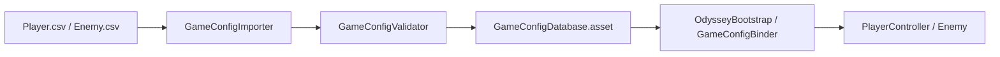
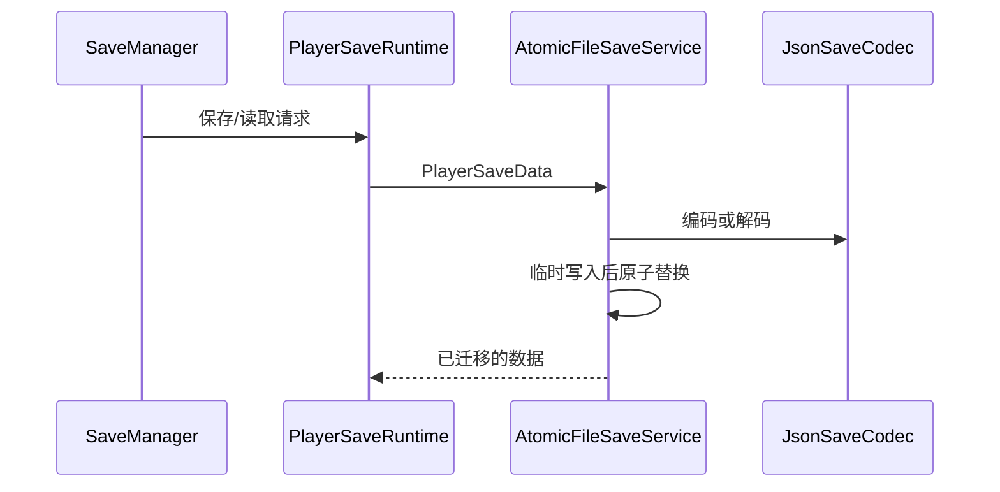

# 05 - 配置、存档与编辑器

## 配置链路

设计数据位于 [Assets/_Project/Data/Design](../../Assets/_Project/Data/Design)。Editor 中的 `GameConfigImporter` 读取 CSV、解析数值和敌人攻击方式，先聚合所有错误再拒绝写入资产。运行时只读取 `GameConfigDatabase.asset`；`GameConfigBinder` 根据配置 ID 将只读数据绑定到玩家或敌人。

这条链路的要点是“导入时失败优于运行时猜测”：CSV 不合法时不能得到半正确的配置资产，角色也不应在 `Start` 中自行搜索或解析文件。

## 存档链路

`PlayerSaveRuntime` 将 `PlayerController` 的可持久化快照与 `PlayerSaveData` 相互转换；`JsonSaveCodec` 只处理序列化格式；`AtomicFileSaveService` 使用临时文件与替换策略降低写入中断损坏风险；`SaveMigrationPipeline` 按版本逐级迁移旧存档。菜单通过 `SaveManager` 发起请求，但不理解 JSON 或版本细节。

新增字段时先决定默认值和旧版本迁移，再调整序列化模型并添加核心规格；不要只在 Unity 组件上追加字段。

## Editor 工具的职责

- `GameConfigAutoImporter`：监听设计 CSV 变化并延迟安排导入，避免资源导入回调中反复重入。
- `SinglePlayerSliceBuilder`：搭建/修复单机玩法切片。
- `CoopLevelNetworkBuilder` 与 `GameMenuSceneBuilder`：为原关卡补齐网络和菜单对象。
- `OdysseyTestRunner`：从 Unity 菜单执行 EditMode 和 PlayMode 测试，并写入可读结果。

这些工具只能在 Editor 程序集引用 UnityEditor；运行时程序集不能反向依赖它们。
