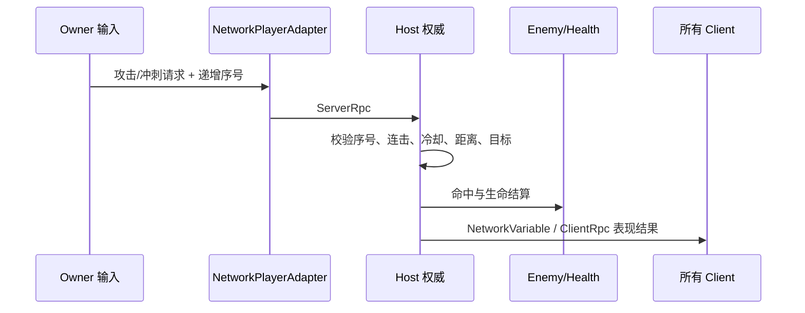

# 06 - 双人合作联机

## 会话和权威模型

`GameplaySessionController` 是场景级 Facade，负责选择单人 Host、联机 Host 或 Client、连接审批、出生点和本机装配。它不成为全局单例，也不把 NGO 细节交给玩家、AI 或 UI。

Owner 负责本机移动和动画表现，保持手感；Host 是攻击、生命、AI、投射物、复活与遭遇状态的唯一规则写入者。[NetworkPlayerAdapter](../../Assets/_Project/Code/Network/NetworkPlayerAdapter.cs) 使用端口接入原 `PlayerController`：后者依赖 `IPlayerAttackResolver` 与 `IExternalPlayerDamageAuthority`，而非引用网络程序集。

## 为什么请求需要验证

[NetworkAttackRules.cs](../../Assets/_Project/Code/Network/NetworkAttackRules.cs) 拒绝重复或过期序号、非法连击、冷却中、无目标和超距离攻击。Client 的“我按了攻击”是请求而不是事实；只有 Host 的物理查询与 `Health` 结算才是事实。这既避免网络延迟下的双写，也避免客户端伪造无效伤害。

## 同步对象

- `OwnerAuthoritativeNetworkTransform` / `Animator`：角色表现由拥有者同步。
- `NetworkEnemyAdapter`：Host 驱动怪物，向其他客户端表现生命、死亡和投射物。
- `NetworkProjectileAdapter`：投射物解析后由 Host 销毁网络对象。
- `NetworkEncounterAdapter` 与 `NetworkGateAdapter`：同步遭遇完成和开门结果，不让每台客户端自行判断。

## 联机排错顺序

1. 确认 `GameplaySessionMode`、连接状态和人数，再检查 Player Prefab 与出生点。
2. 只在 Host 观察规则日志/生命值；Client 异常时检查请求序号和 RPC 结果。
3. 门、怪物或投射物不同步时，检查是否由 Host 创建/写入，以及 `OnNetworkSpawn` 是否订阅事件。
4. 用 [CoopLevelAcceptance.md](../Acceptance/CoopLevelAcceptance.md) 完成双开验收；本项目不包含 NAT 穿透或互联网匹配。
